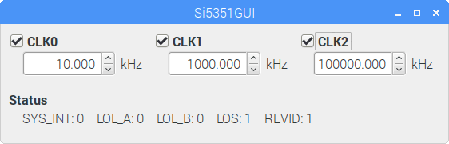

# Si5351 C++ Library for Raspberry Pi
This is a C++ Library for Si5351 on Raspberry Pi, ported directly from the [library for Arduino](https://github.com/etherkit/Si5351Arduino). All interfaces are the same as those in the Arduino library except for the contructor, which takes an extra parameter for the I2C device path, see below. Refer to the Arduino project for the complete reference of the interfaces.
```
Si5351 si5351("/dev/i2c-1"); //Default i2c address SI5351_BUS_BASE_ADDR (0x60)
```
Or
```
Si5351 si5351("/dev/i2c-1", SI5351_BUS_BASE_ADDR); //Replace SI5351_BUS_BASE_ADDR with correct address if it is not 0x60
```
# GUI controller based on Qt
A GUI program making use of this library is provided under GUI. It is based on Qt and can be built from the GUI folder using the following steps (assuming the Qt develpment environment is installed):
```
qmake Si5351GUI.pro
make
```

